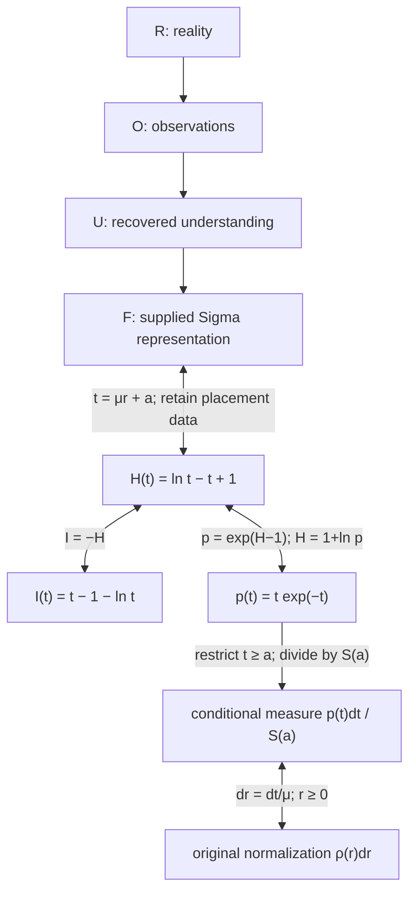
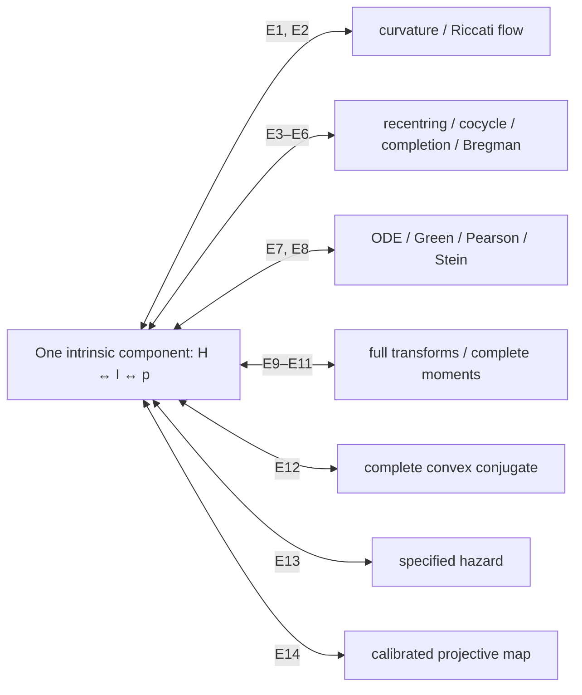

# Sigma: exact identity and dependency ledger

12 September 2026. Companion to the proof manuscript. This ledger starts from identities within one invariant, then classifies arrows. It is complete for the manuscript's result inventory.

## Exact representation spine

For \(\mu>0,\gamma>\mu\), set
\[
a=\mu/\gamma,\quad b=-1/\gamma,\quad
r_*=1/\mu-1/\gamma,\quad t=\mu r+a.
\]
The complete domains map bijectively:
\[
(b,\infty)\longleftrightarrow(0,\infty).
\]
The exact identities are
\[
\sigma(r)-\sigma(r_*)=H(t)=\ln t-t+1=-I(t),
\qquad p(t)=e^{H(t)-1}=te^{-t}.
\]
\[
H(t)=\ln[p(t)/p(1)],\quad p(1)=e^{-1},\qquad
\rho(r)\,dr=p(t)\,dt/S(a),\quad S(a)=(1+a)e^{-a}.
\]
The full intrinsic normalization is exactly Gamma(2,1). On \(r\ge0\), this is exactly conditional normalization on \(t\ge a\): a domain restriction and normalization inside the same invariant.

The formal bidirectional arrows retain the specified coordinate data. There is no reverse inference from \(F\) to reality. Restriction alone cannot reconstruct an arbitrary density below a cutoff; canonical family membership or analytic continuation supplies that reconstruction here.

## Master equivalence component

Each E clause reconstructs the same \(H,I,p\), with \(I=-H\), \(p=e^{H-1}\), \(h(z)=H(1+z)\) and the regularity stated in the manuscript. All reverse implications are proved in Section 2.

| ID | Complete characterization | Calibration and scope |
|---|---|---|
| E0 | \(H=\ln t-t+1\) | \(t>0\) |
| E1 | \(H''=-t^{-2}\) | \(H(1)=H'(1)=0\) |
| E2 | Riccati \(H''=-(H'+1)^2\), or exact Möbius translation flow | \(H(1)=H'(1)=0\) |
| E3 | Exact tangent-subtracted multiplicative recentering | Every positive center and argument; \(H''(1)=-1\) |
| E4 | \(h(x+y+xy)=h(x)+h(y)-xy\) | \(h'(0)=0\), all \(x,y>-1\) |
| E5 | \(\ell(h'(z))=-\ell(z)\), \(\ell=\mathrm{id}+h\) | \(h(0)=0\), injective completion map, composition defined on the domain |
| E6 | Scale-invariant Bregman divergence | Strict convexity; \(I(1)=I'(1)=0,\ I''(1)=1\) |
| E7 | Repeated-root ODE / causal Green equation / two-exponential convolution | Endpoint condition and unit mass; causal support for the Green version |
| E8 | Pearson / Stein identity | Probability density; every compactly supported smooth test function |
| E9 | Full Laplace transform \((1+s)^{-2}\) | All \(s\ge0\) |
| E10 | Complete moment sequence \((n+1)!\) | Every \(n\ge0\) |
| E11 | Mellin line \(\mathbb E T^{i\xi}=\Gamma(2+i\xi)\) | Every real \(\xi\); equivalently the full transform |
| E12 | Exact convex conjugate \(-\ln(1-\theta)\) | Proper closed convex extended-real function, infinite for \(\theta\ge1\) |
| E13 | Hazard \(x/(1+x)\) | Positive survival and \(S(0)=1\) |
| E14 | Cross-ratio preservation by \(H'\) | Injective map; three calibrated values and \(H(1)=0\) |

Further proved equivalents are given in the manuscript: normalized signed self-concordance equality; calibrated zero Schwarzian; the uniquely maximizing entropy density under the specified mean and log-mean constraints; full normalized Laguerre orthogonality; and the fully specified Gamma/Erlang, exponential-sum, size-biased exponential or second Poisson-arrival constructions.

## Consequence and construction tree

Nodes are listed once, with cross-links retained.

```mermaid
flowchart TD
  E["Intrinsic component E0–E14"]
  E --> C1["C1: derivatives, closure, Taylor series, transforms"]
  E --> C3["C3: self-survival shift"]
  C3 <-->|"coordinate and calibration"| C4["C4: logistic composed hazard"]
  E --> C5["C5: Lambert inversion and involution"]
  E --> C2["C2: law of I(T), moments, cumulants"]
  C5 -->|"branches for density"| C2
  E --> C6["C6: group quotient / Bregman"]
  E --> C7["C7: Legendre pairs and gradients"]
  C6 --> C8["C8: metric / exact divergence-distance relation"]
  C7 --> C9["C9: KL / rate function / Poisson cumulants"]
  E -->|"retain μ,a"| C10["C10: original reconstruction"]
  C10 --> C11["C11: curvature measure / cross-ratio"]
  C10 --> C12["C12: placed transforms / scale / branch domains"]
  E -->|"shape/time parameter"| X1["X1: Gamma semigroup / Levy measure"]
  E -->|"specified operator"| X2["X2: squared resolvent"]
  E -->|"diffusion coefficient t"| X3["X3: Laguerre / CIR"]
  X3 <-->|"specified radial construction"| G["4D Gaussian / OU radial sector"]
  X1 -->|"iid sampling"| X4["X4: Gaussian limit"]
  E -->|"Haar weighting of same kernel"| H["X4: Gumbel / max stability"]
  C5 -->|"analytic inverse / Poisson offspring"| X5["X5: trees / critical branching"]
  E -->|"rank + additive spectral lift"| X6["X6: matrix extension"]
  C10 -->|"squared radius + residual cancellation"| X7["X7: spatial closure"]
```

| Node | Exact result and reverse audit |
|---|---|
| C1 | Derivative hierarchy, closure, derivative-zero lattice and full transforms. Full transforms reverse; finite jets or generic rank statements do not. |
| C2 | Exact deficit MGF, density, every cumulant and every moment. The law of \(I(T)\) loses the allocation between Lambert branches. |
| C3 | \(S(x)=p(1+x)/p(1)=e^{-J(x)}\). Shape 2 is unique among non-exponential Gamma/Erlang shapes. At rate \(\beta\), the shift is \(1/\beta\); unit rate fixes the intrinsic member. |
| C4 | Logistic \(v(u)=\lambda(e^u)\), with \(v'=v(1-v)\) and \(v(0)=1/2\), reverses through E13. The hazard of \(Y=\ln T\) additionally has the Jacobian factor \(e^u\). |
| C5 | Smooth decreasing involution preserving \(H,I,p\), with unique fixed point 1. Full inverse functions determine levels; the involution alone does not. It differs from multiplicative inversion. |
| C6 | \(B_J(x,y)=J(x\ominus y)\) and \(D(t,s)=I(t/s)\). The exact two-point function reverses via \(D(t,1)=I(t)\). |
| C7 | \(J^*(\theta)=J(-\theta)\); \(\Lambda'=\exp_\star\) and \((\Lambda^*)'=\log_\star\). Full gradient maps with additive data reverse; reflected self-duality alone does not. |
| C8 | \(ds_g^2=dt^2/t^2\) and \(D(t,s)+D(s,t)=4\sinh^2(d(t,s)/2)\). Metric plus affine calibration recovers \(I\); distance alone loses direction. |
| C9 | Exact specified KL identities, exponential rate function, centered Poisson log MGF and singleton-free partition coefficients. Full functions recover \(I\); generic labels do not. |
| C10 | Canonical local-to-global Sigma recovery, transport, derivatives and zero lattice. Family membership is essential for recovery from finitely many values. |
| C11 | Specified curvature measure sends \(U=(1+\gamma r)^{-1}\) to uniform measure. The specified map recovers curvature, then affine data recover Sigma. Generic uniformizability or projectivity does not. |
| C12 | Original Laplace/Mellin transforms, two-moment recovery, scale laws and domain-aware Lambert roots. Finite recovery statements retain family membership. |
| X1 | Gamma convolution semigroup; exact Levy density \(2e^{-x}/x\) for \(p\), with zero drift/killing. Exact Levy data recovers E9; infinite divisibility alone does not. |
| X2 | Squared-resolvent integral for a specified nonnegative self-adjoint operator. Identity for every scalar operator recovers E9; one finite spectrum does not. |
| X3 | Laguerre spectrum, CIR generator and 4D OU radial-energy relation. Specified zero-current equation or full Laguerre orthogonality recovers \(p\). Density alone does not select diffusion coefficient or angular law. |
| X4 | Exact Gamma sums and Gaussian limits; alternate Haar weighting yields Gumbel. Limit arrows are one-way. The measure change is stated explicitly. |
| X5 | Tree inverse coefficients and critical Poisson branching. Full analytic inverse determines \(p\); criticality or tail exponent alone does not. |
| X6 | Positive-definite additive spectral lift, matrix inversion displacement and reflected conjugacy. Scalar restriction reverses, but the lift adds rank and a spectral rule. General positive-definite matrices do not form the scalar commutative product group. |
| X7 | Residual cancellation iff \(D=3\) among integer \(D\ge2\), plus spherical maximum. Squared-radius evaluation and the self-closure criterion are explicit inputs, not consequences of \(H\) alone. |

## Requested-structure index

| Structure | Manuscript locator |
|---|---|
| Full coordinate identity and conditional normalization | Theorem 1.1 |
| Log-density ratios | Theorem 1.1 |
| All moments and cumulants of \(I(T)\) | C2 |
| Self-survival shift and Erlang uniqueness | C3 |
| Logistic composed hazard | C4 |
| Lambert branch-switching involution | C5 |
| Curvature uniformization | C11 |
| Cross-ratio law and its calibrated reverse | E14, C11 |
| 4D Gaussian / OU–Laguerre | X3 |
| Formal-group exp/log as Legendre gradients | C7 |
| Exact divergence–geodesic formula | C8 |
| Repeated-root Green function / convolution | E7, X2 |
| Corrected Levy density | X1 |

## Verification status

The manuscript proves the calibrated equivalences, consequences and stated constructions. It does not infer identities of entire mathematical disciplines or reverse the user's \(R\to O\to U\to F\) discipline.

The blind and unblinded audits are supporting records. The manuscript maps their phases to the relevant nodes and preserves their stated limits. The reconstruction passed 59 symbolic and numerical checks, detailed in the verification ledger. The supplied MPFR harness and formal proof kernels were not rerun here.
