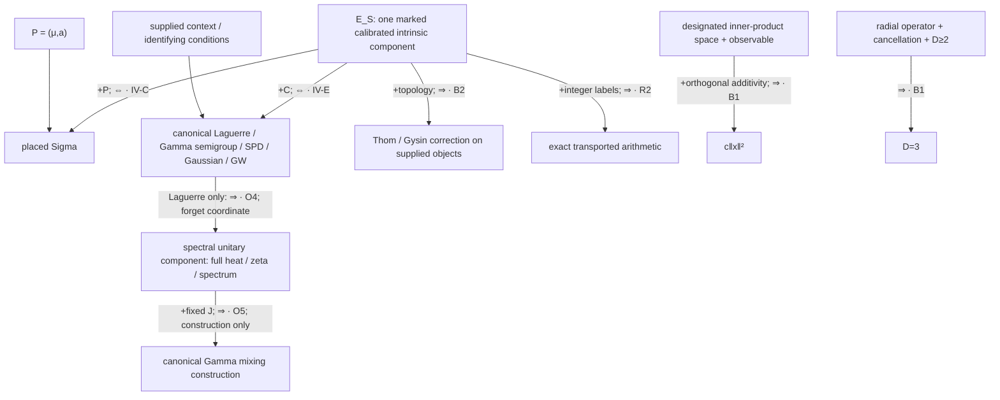

# Sigma Phase IV: reconstruction closure and its exact boundary

12 September 2026. The theorem universe is the marked analytic reconstruction clauses and realization templates enumerated below, together with the Phase III consequence inventory. The scope is mathematical reconstruction inside the supplied formal structure. No arrow in this document reverses \(R\to O\to U\to F\).

## 1. Definitions and quantifiers

On the marked positive real coordinate, put
\[
 H(t)=\log t-t+1,\qquad I(t)=-H(t),\qquad p(t)=e^{H(t)-1}=te^{-t},\qquad S=(H,I,p).
\]
The triple has **one function's information**, since either of its three entries determines the other two. It has no free shape parameter after calibration. In the fixed real analytic foundations these are explicitly definable functions; an intrinsic *reconstruction certificate* is not an extra numerical parameter.

Three assertions have different quantifiers:

1. **Intrinsic identification:** every candidate in a stated marked class satisfying its complete clause equals the indicated intrinsic object.
2. **Canonical construction:** a specified recipe constructs \(F_C(S)\) in a supplied context \(C\).
3. **Identification in a context:** every supplied object satisfying the recipe's identifying conditions equals \(F_C(S)\), up to the stated isomorphism.

The second assertion does not imply the third after its conditions are removed. In particular, reconstruction is not an arbitrary constant-output operation on a forgotten datum. The inverse must recover the candidate whose information was encoded. This convention excludes the erroneous identification cycle “forget a stationary realization to its spectrum, then select a different canonical realization.”

For germs we distinguish two exact statements. The complete formal germ determines the corresponding formal intrinsic germ. It also determines the displayed canonical real analytic representative. To identify an **arbitrary supplied global candidate** from that germ, the candidate must lie in the connected real analytic continuation class. That class is retained on the node; it is not silently inferred for an arbitrary smooth extension.

## 2. The complete intrinsic component

The following registry defines \(E_S\). Each row is an explicitly marked *presentation*, including its stated domain, calibration and admissible class. Rows grouping alternative presentations mean one node per alternative in the JSON graph. The theorem IDs refer to complete proofs in [the proof record](sigma-phase-iv-proof-record.md) and the independent reports linked there. “Partial Lean” means only the precise exported statements in [the verification record](sigma-phase-iv-verification.md), never the entire row by association.

| ID / presentations | Complete data and inverse | Category; domain / scope | Formal coverage |
|---|---|---|---|
| C0: \(H,I,p\) | \(I=-H\), \(p=e^{H-1}\), \(H=1+\log p\) | Analytic; marked \(t>0\), global | Intrinsic algebra |
| C1: curvature / Riccati | \(H''=-t^{-2}\), or \(q'=-q^2,q(1)=1,q=H'+1\); \(H(1)=H'(1)=0\) | Differentiable/analytic; full positive interval; indicated derivatives exist | Derivative reconstruction, not Riccati theory |
| C2: recentering | \(H(av)-H(a)-aH'(a)(v-1)=H(v)\), all \(a,v>0\), \(H''(1)=-1\); both affine anchors follow | Differentiable globally; second derivative required initially only at one | Written proof |
| C3: logarithm / cocycle / completion | \(\ell(x\star y)=\ell(x)+\ell(y),\ell'(0)=1\); or \(h(x\star y)=h(x)+h(y)-xy,h'(0)=0\); completion uses its exact domain condition | Marked \(x\star y=x+y+xy\), \(x>-1\); global, or characteristic-zero formal germs | Group identities; normalized logarithm subset |
| C4: Bregman / symmetric slice | Anchored differentiable potential; complete divergence \(B_I(t,s)=I(t/s)\), or symmetric slice \(t+t^{-1}-2\). Scale invariance needs only differentiability and one scale calibration | Marked affine positive coordinate; global | Anchored symmetric-slice converse |
| C5: Legendre | Entire conjugate \(-\log(1-\theta)\) for \(\theta<1\), \(+\infty\) otherwise; candidate either lower semicontinuous or convex | Extended-real function on \((0,\infty)\), extended by \(+\infty\) outside; global | Written proof |
| C6: calibrated self-concordance / Hessian metric | Signed equality for \(I''\), unit curvature and affine anchors; alternatively the actual Hessian metric \(dt^2/t^2\) in its marked affine coordinate | Analytic; \(t>0\); metric as a tensor with its affine marking | Written proof |
| C7: calibrated projective derivative | Complete cross-ratio/Möbius derivative, values \(0,-1/2,-2/3\) at \(1,2,3\), and \(H(1)=0\) | Marked real projective/affine coordinate; derivative defined on \((0,\infty)\) | Written proof |
| P1: Gamma law / Laplace / moments / Mellin | Complete Gamma(2,1) law; Laplace \((1+s)^{-2}\); all moments \((n+1)!\); or Mellin line \(\Gamma(2+i\xi)\) | Positive Borel measure; all specified arguments. Moments derive mass and positive support even from a candidate on \(\mathbb R\) | Written proof |
| P2: Poisson recurrence / centered CGF / oriented KL | \((n+1)\pi_{n+1}=\pi_n\) and probability mass; \(\Lambda=e^u-1-u\) near zero; or \(\mathrm{KL}(\mathrm{Poi}(1)\Vert\mathrm{Poi}(t))=I(t)\) | Marked integer masses or real CGF coordinate / positive mean coordinate; normalized centering convention | Recurrence, normalization and exponential series; scalar CGF/KL algebra |
| P3: normalized Gumbel / Haar kernel | CDF laws \(F(x+\log2)^2=F(x)\), \(F(x+\log3)^3=F(x)\), \(F(0)=e^{-1}\); alternatively complete marked Haar-weighted kernel | CDF on marked \(\mathbb R\); \(t=e^{-x}\), multiplicative Haar \(dt/t\); global | Written proof |
| P4: joint deficit law and level involution | The law of \(J(T)\) under its own \(e^{-1-J(t)}dt\) equals the prescribed law of \(I(T)\) under \(p\), **and** its coordinate involution equals the prescribed \(I\)-level involution; strict two-branch continuous class, minimum at one, both endpoint limits infinite | Analytic/probabilistic; global linked data concerning the same \(J\); either marginal alone is insufficient | Written proof |
| P5: survival / logistic / Green / probability transforms | Complete normalized survival or marked logistic initial-value solution; causal repeated-root ODE with \(p(0)=0\) and mass one; complete Stieltjes transform; normalized size-bias or equilibrium inverse with no zero atom | Specified half-line or log coordinate; full functions and their displayed inverse conventions | Written proof |
| F1: Todd \(k=0\) tower | \(Q\in\mathbb Q[[u]]\), **\(Q(0)=1\)**, \([u^n]Q^{n+1}=1\) for every \(n\ge1\) | Characteristic-zero formal series; analytic representative/continuation as above | Actual formal-series triangular uniqueness |
| F2: Todd / A-hat / L / normalized \(\chi_y\) | Complete series with marked \(u\), removable value one; fixed marked \(y\ne-1\) for \(\chi_y\); explicit reversible maps below | Formal and canonical global real analytic functions; no bundles required | Reversible maps and specified representative identities |
| P6: rooted-tree / Borel germ | Complete coefficients with EGF/PGF and scale marks; \(T=xe^T\), \(T(0)=0\); \(B(s)=T(s/e)\) | Analytic inverse germ; global identification retains continuation class | Written proof |
| R1: complete Calkin–Wilf / Farey / Möbius presentation | Numerical rational labels, root and left/right or endpoint marks, and Möbius membership; recover \(L=x/(1+x),R=1+x\), then \(I(t)=\int_0^{t-1}L(s)ds\) | Marked projective presentation with the real extension to \(s>-1\); global | Written proof |
| O1: normalized weak Stein law | Probability \(P\) on \(\mathbb R\) satisfying \(\int[tf'+(2-t)f]dP=0\) for every \(f\in C_c^\infty(\mathbb R)\) | Measure/distribution category; density and support are conclusions | Written proof |
| O5: linked mixing-measure characterization | Candidate measure \(\nu\) has all integer exponential moments \((n+1)^{-2}\); equivalently it is the unknown measure in the fixed J operator identity | The *mixing measure* is the candidate; finite positive measure on \(\mathbb R\), support derived | Written proof |
| O6: complete Bernstein samples | A Bernstein function's entire integer tail agrees with \(2\log(1+n)\); its representation is retained | Analytic/Lévy category; any \(n\ge N\), fixed finite \(N\ge1\); global | Written proof |

The canonical normalized entropy maximizer and complete marked Laguerre orthogonality are alternative P1 characterizations: the entropy inverse uses the exact mean and log-mean constraints; orthogonality to the constant determines the Gamma moments through the triangular polynomial coefficients. They add no primitive beyond P1. Finite moments or finitely many polynomial constraints are different data.

The exact completion clause in C3 and the sharp regularity statements in C2/C4 are given in the core audit; no undocumented injectivity or second-derivative hypothesis is imported from the older shorthand ledger.

### Theorem A — intrinsic uniqueness; \(\boldsymbol{\Leftrightarrow}\)

There exists exactly one calibrated intrinsic analytic Sigma object on the marked positive real coordinate. Every complete clause in the registry identifies that object uniquely in its stated candidate class. For a formal node the direct conclusion is the unique formal germ; the global identification uses the explicitly retained analytic continuation class.

**Proof.** Existence is given by the displayed formulas. C1–C7 identify the logarithm or the anchored potential; P1–P5 and O1/O5 identify the normalized measure or linked potential; P2 also recovers \(e^u=1+\Lambda'(u)\); F1/F2 recover the normalized exponential/logarithm germ; P6 recovers \(t e^{-t}\) by analytic inversion; R1 recovers the derivative and its anchor; O6 recovers the Lévy exponent and hence P1. The exact identifying arguments and hypothesis countermodels are recorded theorem by theorem in the proof record. None uses numerical checks as a universal proof.

### Theorem B — reconstruction closure and global uniqueness; \(\boldsymbol{\Leftrightarrow}\)

For every presentation \(A\in E_S\) there are the specified encoding and decoding maps
\[
 S\mathrel{\mathop{\longleftrightarrow}^{\mathrm{enc}_A}_{\mathrm{dec}_A}} A
\]
with both reconstruction identities on the stated admissible classes. Consequently every two complete presentations \(A,B\in E_S\) satisfy
\[
 A\Longleftrightarrow S\Longleftrightarrow B,
\qquad A\mapsto\mathrm{enc}_B(\mathrm{dec}_A(A)).
\]
This is one closure theorem; the pairwise statements are its corollaries. The component is maximal **in the finite audited proof-edge relation with the retained signatures**, not in every conceivable mathematical presentation. Nodes outside it have a lost datum, an external realization argument, an explicit countermodel, or are construction outputs whose identifying inverse requires an additional stated linkage. This graph statement is not a blanket impossibility theorem for every omitted inverse. Canonical-selection arrows are not used to compute the intrinsic component.

**Proof.** The individual inverses are those in Theorem A. Composing them gives the displayed maps, and substituting the two reconstruction identities proves both round trips. Reachability adds no new hypothesis: every path retains its domain, marking and candidate category. The graph construction checks this by excluding construction-only and conditional-with-unprovided-context edges from the intrinsic SCC calculation. The proof is the composition of the independently established inverses, not merely the existence of a directed cycle.

Thus the audited presentations exhibit *bidirectional dissolution of separateness* in the precise sense of mutual reconstruction through this one calibrated invariant.

## 3. Placement and the reduced root

### Theorem C — placed reconstruction; \(\boldsymbol{\Leftrightarrow}\)

For \(P=(\mu,a)\), \(\mu>0,0<a<1\),
\[
 \sigma_P(r)=H(\mu r+a)+\log\frac{\mu}{1+a}+a-1,
 \qquad r>-a/\mu.
\]
Therefore \((S,P)\Longleftrightarrow\sigma_P\). Inside the Sigma family,
\[
 q=\sqrt{-\sigma''},\qquad \mu=q-\sigma',\qquad
 \gamma=\frac{q}{1-rq},\qquad a=\mu/\gamma.
\]
These recover the same \(P\) at every point in the domain. The denominator is positive there. Normalization fixes amplitude: \(e^{\sigma_P}\) has integral one on \([0,\infty)\). Its integral on the entire analytic domain is \(e^a/(1+a)\), so that larger-domain normalization must not be silently substituted.

Changing \(\mu\) at fixed \(a\), or changing \(a\) at fixed \(\mu\), preserves every intrinsic node but changes the placed function. Thus the placement pair cannot be recovered from an intrinsic presentation. A finite jet recovers it only with the placed-family membership retained.

### Theorem D — relative minimal root and irredundancy

The minimal **shape root** is any one complete intrinsic certificate, equivalently one of \(H,I,p\); the triple \(S\) is redundant storage. There are zero free intrinsic shape parameters after that certificate is imposed. The freely varying scalar parameters of the placed family are precisely \((\mu,a)\).

For the full architecture the correct decomposition is dependent, rather than a list of mutually independent local hypotheses:
\[
 \boxed{\text{one intrinsic certificate}\ ;\quad
 P\text{ if placement is requested}\ ;\quad
 \text{the arguments/marks selecting the requested external realizations}.}
\]
Fixed mathematical foundations and deterministic realization recipes are not additional free parameters. Injectivity of the original placed code is a predicate of \(P\), not an independently variable root datum. Continuation is an inverse theorem's candidate-class condition, not an additional global datum once \(S\) itself is supplied. Drift vanishes once the complete time-one Gamma law and convolution category are retained. All alternative intrinsic certificates are redundant if another complete one is already supplied.

The exact blockwise irredundancy theorem, its explicit candidate universe and two-model witnesses are in [minimal primitives](sigma-phase-iv-minimal-primitives.md). It proves necessity relative to those targets and conventions. An assertion of a universally shortest encoding, or that every local side condition is an independent root coordinate, is refuted by the dependencies just listed.

## 4. Canonical realization theorem

### Theorem E — canonical construction and identification; \(\boldsymbol{+H;\Leftrightarrow}\) where the context is retained

The following are **fibres of canonical templates**. For a supplied admissible context \(C\), the object is uniquely fixed under the listed identifying conditions. Restriction to its marked scalar datum recovers \(S\). The pair \((S,C)\), rather than unmarked \(S\) alone, is the input when \(C\) is an actual externally supplied instance.

| Template | Existence from \(S\) and the context | Exact uniqueness / inverse | What it does not identify |
|---|---|---|---|
| Gamma convolution | \(\mu_r=\Gamma(2r,1),\mu_0=\delta_0\), additive time, convolution of probabilities on \([0,\infty)\) | Any such completion with \(\mu_1=pdt\) has Laplace transform \((1+\lambda)^{-2r}\); weak continuity follows. Evaluate at time one for the inverse | A process with only its time-one marginal specified |
| Local Stein/Laguerre | \(A=-[t\partial_t^2+(2-t)\partial_t]\) in \(L^2(pdt)\); centered coordinate and minimal differential expression retained | Two marked polynomial probes identify its coefficients; the Pearson law fixes its normalized weight; both endpoints are limit point, so its self-adjoint closure is unique | An arbitrary isospectral stationary coordinate realization |
| SPD spectral lift | \(\Phi_n(X)=\sum I(\lambda_i(X))=\operatorname{tr}X-\log\det X-n\) | Orthogonal invariance plus scalar-block recursion and rank-one seed force it by diagonalization; rank-one restriction is the inverse | An arbitrary function on matrices agreeing at rank one |
| Isotropic Gaussian radius | On supplied \(\mathbb R^4\), set \(Z=\sqrt{2T}U\), \(T\sim p\), independent uniform sphere angle | Rotation invariance and the radial law force this distribution; conditional uniformity is an almost-everywhere assertion. The radial coordinate recovers \(p\) | An arbitrary angular kernel, or physical spatial dimension |
| One-ancestor iid GW | Product construction with Poisson(1) offspring | Borel total progeny plus the iid-GW framework forces offspring PGF \(e^{w-1}\), hence the tree law in its specified convention | An arbitrary random tree with Borel total size |
| Universal Thom comparison | Supplied complex K/cohomology, Euler/Thom comparison and splitting foundations; correction \(\mathrm{Td}^{-1}\) | Universal line identity \(uC(u)=1-e^{-u}\) fixes \(C\); splitting fixes the total correction; complete universal line data reverse to \(Q_T\) | Bundles, integral K-classes or Thom foundations from scalar series; finite-base truncations do not recover a universal tail |

The first three canonical templates are the operator, semigroup and matrix presentations in the candidate closure theorem. In a **fixed** template their nodes may be adjoined to \(E_S\) as the fibre \(E_S[C]\). The unconditional intrinsic quotient does not discard \(C\). The JSON records both the intrinsic component and these conditional fibres; it does not confuse a family of constructions with identification of an arbitrary supplied object.

### Spectral information has its own quotient

For the canonical Laguerre closure,
\[
 \operatorname{Tr}(1+A)^{-s}=\zeta(s),\quad\Re s>1,
 \qquad \operatorname{Tr}e^{-\tau A}=(1-e^{-\tau})^{-1},\quad\Re\tau>0.
\]
These are exactly the ordinary trace-class domains. Complete finite trace data determine the eigenvalue multiset and the self-adjoint operator's unitary class. The values \(\zeta(k)\), all integers \(k\ge2\), also suffice, by compact moment uniqueness. A finite list of values, or a single determinant, does not.

The full kernels, shifted resolvents, Fredholm determinants and zeta determinants in the operator audit retain their exact domains. In particular,
\[
 \det_\zeta(A+\alpha)=\frac{\sqrt{2\pi}}{\Gamma(\alpha)}\ (\alpha>0),\quad
 \det(I+z(1+A)^{-2})=\frac{\sinh(\pi\sqrt z)}{\pi\sqrt z},
\]
\[
 \det_2(I+z(1+A)^{-1})=\frac{e^{-\gamma_E z}}{\Gamma(1+z)}.
\]
The last two expressions are entire functions, with removable values interpreted accordingly. The regularization identity for the first formula is [NIST DLMF 25.11.18](https://dlmf.nist.gov/25.11.E18); the two products follow from [DLMF 4.36.1](https://dlmf.nist.gov/4.36.E1) and [5.8.2](https://dlmf.nist.gov/5.8.E2).

The fixed J recipe reconstructs its Gamma(2) **mixing measure**. It does not turn spectral data into the stationary coordinate law: \(A_2\) and \(A_3\), with Gamma shapes two and three, have identical integer spectra and both satisfy the same J identity with the same Gamma(2) mixing measure. This is why the bare spectral component is separate from \(E_S\).

**P9: one linked self-decomposition also closes.** For \(0<c<1\), an unknown Borel probability law on \(\mathbb R\) satisfying \(X\stackrel d=cX'+Y_c\), with an independent copy and independent residual whose transform is \(((1+c\lambda)/(1+\lambda))^2\), is necessarily Gamma(2,1). Iterating its characteristic-function equation telescopes and uses continuity at zero, so positive support and moments need not be supplied. The residual's atom \(c^2\) at zero recovers its scale. Thus this is **+H; ⇔** with the original-law linkage retained; the residual output alone does not identify an arbitrarily designated unrelated law. The endpoint \(c=0\) also identifies the law, while \(c=1\) does not. This conditional inverse completes the existing self-decomposition node.

## 5. Exact boundary theorems and closure of the open question

### Theorem F — boundary of scalar reconstruction; \(\boldsymbol{\times}\) for the overstrong arrows

**Spatial.** Keep the whole intrinsic component, every canonical scalar construction and the auxiliary four-dimensional Gaussian realization fixed. Independently supply \(\mathbb R^2\) with radius observable \(\|x\|^4\): orthogonal additivity fails. With \(\|x\|^2\) it holds, but the residual is \(-1/(4x^2)\). In \(\mathbb R\) the residual cancels while dimension is one. These are expansions of the same complete scalar model. Thus the current scalar premises do not identify an ambient spatial sort, its observable or inner product, its dimension, or the cancellation rule.

In a supplied real inner-product space of dimension at least two, global nonnegative orthogonal additivity gives \(r(x)=c\|x\|^2\), \(c\ge0\), without separately assuming continuity or evenness. In the specified radial operator,
\[
 \mathrm{residual}=\frac{(D-1)(D-3)}{4x^2},\qquad x>0.
\]
Cancellation gives \(D\in\{1,3\}\), and the retained condition \(D\ge2\) gives three. The identity holds for every nonzero \(C^2\) profile, so cancellation does not reconstruct Sigma. This is non-derivability from the current premises, not a theorem excluding every future observational or geometric bridge.

**Topology.** The scalar series are uniquely fixed, but an independently supplied base, bundle or integral class is not. Over \(\mathbb{RP}^2\), the trivial complex line and the line with nonzero torsion \(c_1\in H^2(\mathbb{RP}^2;\mathbb Z)=\mathbb Z/2\) have the same rational Chern character and different integral K-classes. Distinct bases also retain all scalar series. Under supplied topology the correction function is fixed; the topological arguments are not recovered from it.

**Arithmetic.** For an injective labelled code \(e\), multiplication transport is exact and its irreducibles are the images of primes. In the original placed code, \(\gamma=1,\mu=\log(5/4)\) gives \(e(3)=e(4)\) but \(e(6)\ne e(8)\); multiplication is not well-defined on the collision quotient. The alternative intrinsic code \(e_0(n)=H(n+1)\), \(n\ge1\), is strictly decreasing and injective, and supplies a canonical labelled multiplicative transport for every placement. It is a different code. Neither theorem reconstructs numerical integer labels or addition from a bare unlabelled real set.

**Other designation losses.** Gamma radii admit nonuniform angles; the same Borel size admits path and star tree laws; the same time-one law admits dependent increments; the same scalar seed admits non-spectral matrix extensions; a smooth compactly supported perturbation preserves a germ but changes its global extension; a Lévy measure alone leaves positive drift. Each countermodel kills only the stated forgotten-data converse, not its conditional identifying theorem.

### Theorem Z4 — the exact all-order zero-set converse is \(\boldsymbol{\times}\)

For every \(k>1\),
\[
 f_k(t)=(k-1)k^k\frac{t}{(t+k)^{k+1}},\qquad t>0,
\]
is a positive real-analytic probability density, and
\[
 f_k^{(n)}(t)=(k-1)k^k(-1)^n(k)_n
             \frac{t-n}{(t+k)^{k+n+1}},\quad n\ge1.
\]
Thus \(Z_n(f_k)=\{n\}=Z_n(p)\) exactly for every order, but \(f_k\ne p\). In particular \(4t/(t+2)^3\) is an explicit counterexample. Normalization and the induction proving the formula are in [the complete proof](phase-iv-audit/zero-set-counterexample.md). This settles the Phase III question in its stated smooth-positive-probability class, including the real-analytic subclass. It does not assert an answer after adding an entire-function or global log-concavity restriction; those strengthened problems are not needed by the closure theorem or added to this architecture.

No mathematical edge in the frozen graph remains `?` in the stated candidate universe. Written proofs and unformalized theorems are distinguished from unknown validity.

## 6. Frozen architecture

The [full and quotient JSON graphs](sigma-phase-iv-graph.json) list every retained node, conditional dependency, theorem ID and formal coverage. The quotient collapses only the intrinsic identification component. A separate spectral component records unitary information. Context-indexed canonical fibres remain visibly conditional; their forgetful projections are not promoted to inverse identifications.

The full graph records topology, arithmetic and spatial inputs separately even where this display compresses their names. The master manuscript remains unchanged. The architecture ends here; no Phase V or outward search is initiated.

## 7. Final verdict: the fifteen required questions

1. **Is there one unique calibrated intrinsic analytic Sigma structure?** YES, on the marked positive coordinate and under any complete identifying clause in \(E_S\). Its three entries contain one function's information.

2. **What is the exact maximal mutually reconstructive component?** The 46 nodes in `intrinsic_component` of the JSON, grouped in Section 2. Maximality is within the frozen identifying proof-edge relation and retained candidate signatures. Canonical operator/semigroup/SPD and other realization templates form conditional fixed-context fibres; bare spectral data form a separate unitary component.

3. **Which Phase III conditional hypotheses disappeared after cross-branch closure?** The scalar L-series projective/hazard bridge, the A-hat Bregman intermediary, nonzero-twist Todd coefficient data/topological interpretation for the scalar tower, candidate Gumbel density smoothness, separate mass/support in complete moments and mixing samples, and mixing-existence in the fixed J construction. The exact conjugate needs lsc or convexity, rather than both. Earlier recentering/E5/endpoint/semigroup-continuity collapses remain valid but are not recounted as new Phase III results.

4. **What remains genuinely independent?** Placement \((\mu,a)\) and the arguments/marks selecting externally requested realizations. The intrinsic shape has no free parameter. Fixed category foundations and deterministic recipes are not numerical parameters; the scale of a designated spatial radius can be a genuine external scalar.

5. **How are the remaining inputs classified?** Placement A; coordinate and parameter marks B; identifying realization categories C; selected observables/objects/experiments D; arithmetic labels E; analytic continuation restrictions for local-to-global candidate identification F; no unresolved graph datum in G. The exact disjoint inventory is in the minimal-primitives document.

6. **Is the root-data list irredundant?** YES, blockwise relative to the explicit deletion universe and requested targets in Theorem D1. It is not a claim of absolute shortest encoding. Deleting a certificate while retaining another complete presentation is expressly excluded from that test.

7. **What proves necessity of each retained block?** Analytic normalized shape perturbations; fixed-shape/different-placement pairs; marked-coordinate relabellings; Gamma2/Gamma3 isospectral realizations; uniform/fixed angles; subordinator/dependent-increment processes; path/star tree laws; noncanonical matrix lifts; torsion/trivial lines on \(\mathbb{RP}^2\); prime-label permutations; and independent spatial dimensions/observables/scales. The full deletion table states what every pair holds fixed and which target differs.

8. **Which canonical realizations are unique once their categories are supplied?** The Gamma convolution completion, marked Laguerre closure, SPD spectral potential, isotropic four-dimensional Gaussian radial law, one-ancestor iid Poisson GW law and universal Todd Thom correction. The linked one-scale self-decomposition is an additional exact conditional probability characterization.

9. **What does the scalar component provably not determine?** Placement, an arbitrary stationary coordinate realization, angular/process/tree/matrix choices lacking their identifying rules, actual topological arguments or integral classes, numerical arithmetic labels from an unlabelled carrier, designated spatial geometry or residual cancellation, and physical reality from formal equivalence.

10. **What remains `?`?** None in the stated frozen graph. The former exact-all-derivative-zero-set problem is **×**, by \(f_k\). Differently constrained entire/log-concave problems are not included or claimed settled.

11. **Which Phase III/IV converses passed independent review?** Every Phase III new theorem cluster has a verdict and resolved signature in the independent-audit inventory. The new Phase IV Bernstein-tail, reduced Bregman/equilibrium/recentering, universal collision-obstruction and linked self-decomposition refinements also passed; Z4's all-order counterexample was independently verified.

12. **Which passed Lean kernel verification?** 69 exported theorems, including 53 new ones: concrete intrinsic/derivative/Bregman and real group-logarithm kernels, normalized Poisson recurrence and exponential-series identities, two actual differential polynomial probes, real characteristic representatives and reversible maps, actual formal-series Todd triangular/tower uniqueness, formal-log ODE uniqueness, and finite list assembly. The exact signatures and all axiom reports are in the verification record. The global analytic closure and boundary/minimality theorems are written proofs, not claimed as fully mechanized.

13. **Are the audited structures in \(E_S\) mutually reconstructible presentations of one calibrated intrinsic invariant?** YES, with exactly their stated markings, domains and candidate classes; pairwise reconstruction follows by composing the independently proved inverses.

14. **Do all structures in the full graph require no independent input beyond Sigma?** NO. Placement and external selection/identification data survive, with explicit countermodels.

15. **Strongest final classification:** The audited intrinsic presentations encode one calibrated analytic invariant; placement and explicitly typed realization selections are the remaining independent data, with conditional constructions and identification boundaries preserved.
